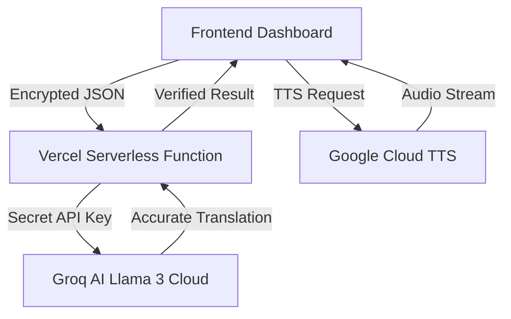

# MediTranslate: Technical Documentation & Implementation Analysis

## 1. Project Vision
MediTranslate is a real-time, clinical-grade translation tool designed to facilitate seamless communication between healthcare providers and patients. Unlike general-purpose translation apps, MediTranslate is architected for **privacy**, **medical accuracy**, and **two-way conversational flow**.

---

## 2. System Architecture
The application follows a **Decoupled Serverless Architecture** to ensure security and scalability.

### Key Components:
- **Unified Control Bar**: Consolidated dashboard for Role selection, Language matching, and Recording.
- **Conversational Engine (`app.js`)**: Manages the chronological state of the session in memory.
- **Security Proxy (`api/translate.js`)**: Shields the Groq API key and applies medical personas to the AI.

---

## 3. Core Technical Features

### A. Two-Way Conversational Mode
Instead of static panels, I implemented a **Chronological History Engine**.
- **State Management**: Uses an in-memory `conversationHistory` array.
- **Role Awareness**: The UI identifies the speaker (Provider vs Patient) and adjusts bubble styling and AI context dynamically.
- **Unified Viewport**: Interleaved chat bubbles provide a natural transcript of the medical consultation.

### B. Clinical Accuracy & Llama 3 prompting
The AI (Llama 3.3 70B) is primed with a specific **Clinical Persona** via the system prompt:
- **Role-Based Tailoring**: Doctors receive professional/authoritative terminology; Patients receive descriptive/symptomatic translations.
- **Literal Precision**: I implemented "Strict 1:1" rules that forbid the AI from adding unrequested greetings or conversational fluff.

### C. Enhanced Speech Recognition
Native browser speech recognition was hardened for high clinical environments:
- **Urdu/Hindi Fallback**: Handles cross-script phonetic similarities by routing Urdu speech through the Hindi engine and then transliterating it back to Urdu script via AI.
- **Web Speech API**: Configured for continuous listening with interim result overlays for instant feedback.

---

## 4. Security & Privacy (Zero-Retention Policy)
Security was built into the foundation of the project:
1. **Zero-Retention**: Transcripts and audio are **never stored** on a server, database, or LocalStorage.
2. **Volatile Memory**: Data exists only in the browser's active RAM. Closing the tab or hitting "Clear All" permanently destroys the consultation record.
3. **Backend Key Masking**: The Groq API key is stored as a secret in Vercel. The client-side code has zero knowledge of the key, preventing scraping or theft.

---

## 5. UI/UX Design System
The "Premium Clinical" aesthetic was developed using:
- **Glassmorphism**: Semi-transparent, blurred backdrops create a modern, high-tech instrument feel.
- **Custom-Themed Selects**: Standard OS dropdowns were replaced with custom CSS components for a cohesive brand experience.
- **Contextual Colors**: Deep Blue (Healthcare Professional) vs Clinical Teal (Patient) ensures clear visual distinction in the transcript.

---

## 6. Deployment & Deliverables
- **Live URL**: https://meditranslater.vercel.app/
- **GitHub Repository**: Muhammad123Ahmad/meditranslater
- **Backend Architecture**: Vercel Serverless (Node.js runtime).

---

## 7. Developer's Note (AI Integration)
This prototype demonstrates how **Generative AI** can be used as a "Live Middleware" to solve complex UI and translation problems that static rules cannot handle. The system is designed to be extensible, allowing for future integration of EMR (Electronic Medical Record) systems while maintaining its core privacy-first mission.
